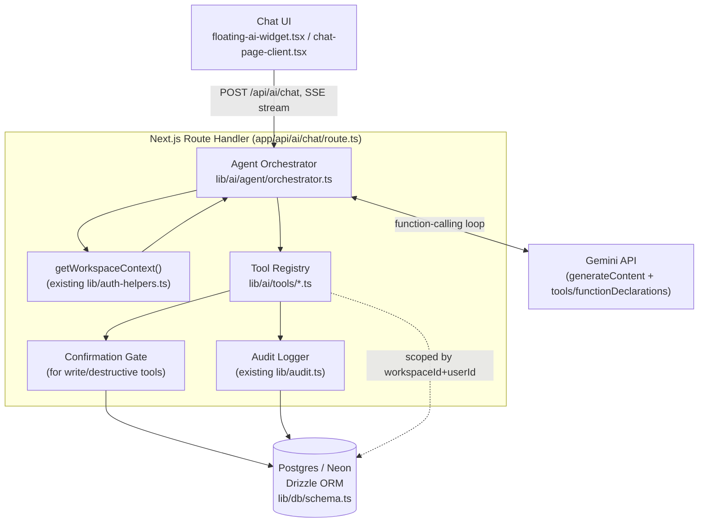
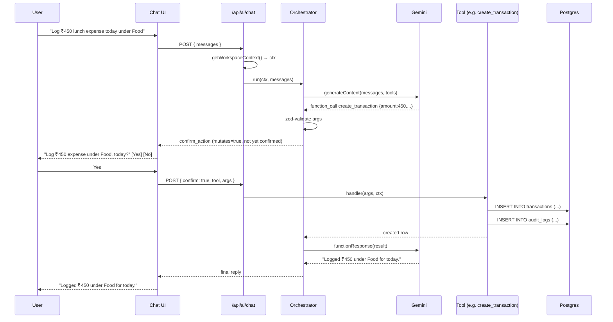

# Aura360 — Agentic AI Assistant Architecture

## 1. Current state (as found in this repo)

Aura360 already has an AI chat feature, but it is a **read-only, context-stuffing chatbot**, not an agent:

```
components/ai/floating-ai-widget.tsx, chat-page-client.tsx
        │  POST { messages }
        ▼
app/api/ai/chat/route.ts
        │  calls getAIContext() → builds a plain-text summary
        │  (last 10 transactions, 40 fashion items, 5 notes, 5 fitness,
        │   5 food, 5 skincare, 5 saved — app/api/ai/context/route.ts)
        ▼
lib/ai/services/journal-assistant.ts
        │  prepends context as a fake first user/model turn
        ▼
lib/ai/gemini-client.ts  →  Gemini REST API (generateContent)
        │  plain text in, plain text out — NO function/tool calling
        ▼
reply string → rendered in chat UI
```

**What this means concretely:**
- The model can only *talk about* a small, fixed snapshot of data it was handed. It cannot query anything outside that snapshot (e.g. "how much did I spend in June" fails if June isn't in the last 10 transactions).
- It **cannot take any action** — no creating a transaction, adding a note, logging a workout, updating a budget, etc.
- `lib/db/schema.ts` already has `auditLogs` and `aiInteractions` tables and `lib/audit.ts` already has `createAuditLog()` — this audit infrastructure exists but the AI layer doesn't use it at all today.
- Every write-side API route (`app/api/finance/transactions`, `app/api/notes`, `app/api/fitness`, etc.) already does the right thing for auth: `getWorkspaceContext()` → `{ workspaceId, userId }` → scoped Drizzle query. This is the pattern the agent's tools must reuse, not bypass.

This document describes how to evolve this into what you asked for: **an assistant that can read across all your modules and take real actions on your behalf, safely.**

---

## 2. Target architecture



Everything below explains each box and maps it to files.

---

## 3. Core design principle

> **The LLM never touches the database. It only ever calls named, typed tool functions that run with the current user's `workspaceId`/`userId`, exactly like your existing API routes do.**

The LLM decides *what* to do ("get last month's transactions", "log this workout", "create a budget of ₹5000 for Food"). Your server decides *how* — every tool internally reuses `getWorkspaceContext()` and the same Drizzle queries your REST routes already use. The model is never given raw SQL access, an admin token, or another user's data.

---

## 4. Components

### 4.1 Gemini client — add function calling
`lib/ai/gemini-client.ts` currently builds a body with only `contents` + `generationConfig`. It needs to:
- Accept a `tools: [{ functionDeclarations: [...] }]` array in `buildBody()`.
- Accept `toolConfig` (mode `AUTO` / `ANY` / `NONE`) so you can force a tool call when needed.
- In `extractText()`, also detect `candidate.content.parts[].functionCall` (name + args) instead of only `.text`, and return it as a structured `{ type: "function_call", name, args }` alongside plain text.
- Support a **second turn**: after your server executes the tool, send the result back as a `functionResponse` part so Gemini can produce the final natural-language reply.

This is additive — `generateText()`/`generateJson()` keep working for `insights-generator`, `transaction-parser`, etc. exactly as they do today; only the chat path gains tool support.

### 4.2 Tool registry — one file per module
New folder: `lib/ai/tools/`

```
lib/ai/tools/
  finance.ts     get_transactions, create_transaction, get_budgets,
                 create_budget, get_balances, get_financial_goals
  fitness.ts     get_fitness_logs, log_workout
  food.ts        get_food_logs, log_meal
  notes.ts       get_notes, create_note, update_note
  fashion.ts     get_wardrobe, get_wishlist, add_fashion_item
  skincare.ts    get_skincare_routine
  time.ts        get_time_logs, log_time_entry
  saved.ts       get_saved_items, save_item
  index.ts       merges all of the above into one registry + Gemini
                 functionDeclarations array
```

Each tool is a plain object:

```ts
// lib/ai/tools/finance.ts
export const getTransactions: AiTool = {
  name: "get_transactions",
  description: "Fetch the user's transactions, optionally filtered by date range, type, or category.",
  parameters: z.object({
    from: z.string().optional().describe("ISO date, inclusive"),
    to: z.string().optional().describe("ISO date, inclusive"),
    type: z.enum(["income", "expense", "investment", "transfer"]).optional(),
    category: z.string().optional(),
    limit: z.number().max(200).default(50),
  }),
  mutates: false,
  handler: async (args, ctx: WorkspaceContext) => {
    const conditions = [eq(transactions.workspaceId, ctx.workspaceId), eq(transactions.userId, ctx.userId)]
    if (args.from) conditions.push(gte(transactions.date, args.from))
    if (args.to) conditions.push(lte(transactions.date, args.to))
    if (args.type) conditions.push(eq(transactions.type, args.type))
    if (args.category) conditions.push(eq(transactions.category, args.category))
    return db.select().from(transactions).where(and(...conditions))
      .orderBy(desc(transactions.date)).limit(args.limit)
  },
}

export const createTransaction: AiTool = {
  name: "create_transaction",
  description: "Create a new income/expense/investment transaction for the user.",
  parameters: z.object({
    type: z.enum(["income", "expense", "investment", "transfer"]),
    amount: z.number().positive(),
    category: z.string(),
    description: z.string().optional(),
    date: z.string(), // ISO date
  }),
  mutates: true,          // ← triggers the confirmation gate
  handler: async (args, ctx) => {
    const [row] = await db.insert(transactions).values({ ...args, workspaceId: ctx.workspaceId, userId: ctx.userId }).returning()
    await createAuditLog({
      workspaceId: ctx.workspaceId, userId: ctx.userId,
      action: "create", entityType: "transaction", entityId: row.id,
      afterState: row, metadata: { source: "ai_agent" },
    })
    return row
  },
}
```

Key points:
- `parameters` is a `zod` schema (already a project dependency) — validate every LLM-supplied argument before it touches the DB, exactly like the `chatSchema` in the existing route.
- Every handler receives `ctx: WorkspaceContext` from the **server session**, never from the LLM. The LLM never sees or sets `workspaceId`/`userId`.
- `mutates: true` on any create/update/delete tool routes it through the confirmation gate (4.4) and the audit logger (4.5) automatically — this is a single place to enforce both, so individual tools can't forget.
- Read tools (`get_*`) reuse the same query shape already in `app/api/ai/context/route.ts` and the module REST routes — you're largely relocating, not rewriting, that logic.

### 4.3 Agent orchestrator — the function-calling loop
New file: `lib/ai/agent/orchestrator.ts`, called from a slimmed-down `app/api/ai/chat/route.ts`.

```
1. auth: const ctx = await getWorkspaceContext()
2. call Gemini with { messages, tools: toolDeclarations }
3. if response is plain text → stream/return it, done
4. if response is a function_call:
     a. look up the tool by name in the registry
     b. validate args with the tool's zod schema
     c. if tool.mutates and not yet confirmed → return a
        "confirm_action" message to the UI (see 4.4), STOP
     d. else run tool.handler(args, ctx)
     e. send the result back to Gemini as a functionResponse
     f. go to step 2 (loop, capped at e.g. 4 tool calls per turn)
5. return final natural-language reply + which tools were used
```

This loop replaces the single `journalAssistant.chat()` call. `journal-assistant.ts`'s system prompt (the "be direct, no filler" rules) is preserved and extended with tool-use instructions and the list of available tools.

### 4.4 Confirmation gate (safety-critical)
Any tool marked `mutates: true` — creating a transaction, logging a workout, adding a note, deleting anything — must not execute silently on the first pass. Two supported patterns, pick one per tool risk level:

- **Inline confirm (default for most writes):** the orchestrator returns a structured message like `{ type: "confirm_action", tool: "create_transaction", args: {...}, summary: "Log ₹450 expense under Food on 22 Sep?" }`. The chat UI renders Yes/No buttons. Only a follow-up "confirmed" request actually invokes `handler()`.
- **Auto-execute allowlist (optional, opt-in per user):** low-risk, easily reversible writes (e.g. `create_note`) can be allowed to run immediately if the user has explicitly turned on "let Aura act without asking" in settings. Never auto-execute financial writes, deletes, or anything touching another workspace member.

This mirrors how a human assistant should behave: read freely, ask before writing, never ask before reading.

### 4.5 Audit logging — reuse what exists
Every `mutates: true` tool call writes to `auditLogs` via the existing `createAuditLog()` in `lib/audit.ts`, with `metadata: { source: "ai_agent", userPrompt: "<original message>" }` so you can always answer "did the AI create this, and why?" This table already has the right shape (`beforeState`/`afterState`/`changes`/`entityType`/`entityId`) — no schema change needed.

Additionally, log every AI turn (tool calls + token usage) to the existing `aiInteractions` table, same as `journal-assistant` conceptually does today via the `service` field — just add `service: "agent_orchestrator"` and record which tools were invoked in `entityType`/`entityId`/`metadata`.

### 4.6 Streaming
`app/api/ai/chat/route.ts` currently returns a single JSON blob. For a good chat UX with a multi-step tool loop, switch to a streamed response (Server-Sent Events or a `ReadableStream`) that emits: `tool_call_started` → `tool_call_result` → `text_delta`(s) → `done`. `components/ai/formatted-message.tsx` and `chat-page-client.tsx` already render markdown; they'd need a small addition to render a "🔧 Checked your transactions" / "✅ Logged workout" trace and the confirm-action buttons.

---

## 5. Request lifecycle (sequence)



---

## 6. Security checklist specific to this codebase

- **Never accept `workspaceId`/`userId` as a tool argument from the model.** Always inject from `getWorkspaceContext()` server-side, same as every existing route does.
- **Validate every tool argument with `zod`** before it reaches Drizzle — the project already depends on `zod` and the existing `chatSchema` in the chat route is the right pattern to copy.
- **Reuse existing scoped queries, don't hand-roll new ones.** The `and(eq(table.workspaceId, ctx.workspaceId), eq(table.userId, ctx.userId))` pattern from `app/api/finance/transactions/route.ts` should be the template for every tool's `where` clause.
- **Gate all mutating tools behind explicit confirmation** (4.4) — no destructive action fires on the first model response.
- **Log every mutation to `auditLogs`** with `metadata.source = "ai_agent"` so AI-driven changes are distinguishable from UI-driven ones in the existing audit trail.
- **Cap tool-call loop depth** (e.g. 4 iterations) to prevent runaway loops burning Gemini quota.
- **Rate-limit `/api/ai/chat`** per user (you don't currently have this — worth adding via a simple counter in Redis/Upstash or a DB table, since repeated tool-calling turns cost more than the old single-shot chat).
- **Multi-user workspaces:** `workspaceMembers` exists in the schema — if a workspace has more than one member, decide now whether the agent may see/act on data logged by other members of the same workspace, or only the requesting `userId`. The existing routes filter by *both* `workspaceId` and `userId`, so the safe default is to keep that combination in every tool.

---

## 7. Phased implementation plan

**Phase 1 — Function-calling plumbing (no new capabilities yet)**
- Extend `lib/ai/gemini-client.ts` with `tools`/`toolConfig` support and function-call parsing.
- Build `lib/ai/tools/index.ts` with just **one read-only tool** (`get_transactions`) to prove the loop end-to-end.
- Build `lib/ai/agent/orchestrator.ts` with the loop from §4.3 (no confirmation gate needed yet since it's read-only).
- Wire into `app/api/ai/chat/route.ts` behind a feature flag, keep the old `journalAssistant.chat()` path as fallback.

**Phase 2 — Full read coverage**
- Add read tools for every module (fitness, food, notes, fashion, skincare, time, saved, budgets, goals, balances) — mostly relocating query logic already in `app/api/ai/context/route.ts` and the module REST routes into reusable tool handlers.
- Retire the fixed-snapshot `getAIContext()` context-stuffing approach — the agent now fetches what it needs on demand instead of a fixed top-10 summary.

**Phase 3 — Write actions + safety**
- Add `mutates: true` tools per module (`create_transaction`, `log_workout`, `log_meal`, `create_note`, `add_fashion_item`, `log_time_entry`, `create_budget`, etc.).
- Implement the confirmation gate (§4.4) and wire Yes/No UI into `chat-page-client.tsx` / `floating-ai-widget.tsx`.
- Wire `createAuditLog()` into every mutating handler.

**Phase 4 — UX polish**
- Switch `/api/ai/chat` to streaming (§4.6).
- Show a visible "tool trace" in the UI (which data the AI checked / which action it took).
- Add per-user setting for the auto-execute allowlist.

**Phase 5 — Observability & limits**
- Log every turn to `aiInteractions` with tool-call metadata.
- Add per-user/per-workspace rate limiting on `/api/ai/chat`.
- Add a simple admin/debug view over `auditLogs` filtered to `metadata.source = "ai_agent"`.

---

## 8. What does *not* need to change

- `lib/db/schema.ts` — no new tables required; `auditLogs` and `aiInteractions` already fit this use case.
- `lib/auth-helpers.ts` — `getWorkspaceContext()` is reused as-is by every tool.
- The other `lib/ai/services/*` (link-enricher, insights-generator, smart-search, transaction-parser) — unaffected; they keep using `geminiClient.generateText/generateJson` directly and don't go through the agent loop.
- Your REST API routes under `app/api/**` — the agent's tools call the same DB layer, not these routes, so no route changes are required (though you may choose to have a tool call the route's exported logic directly if you want a single source of truth — either approach works, just don't let two implementations of the same query drift apart).
